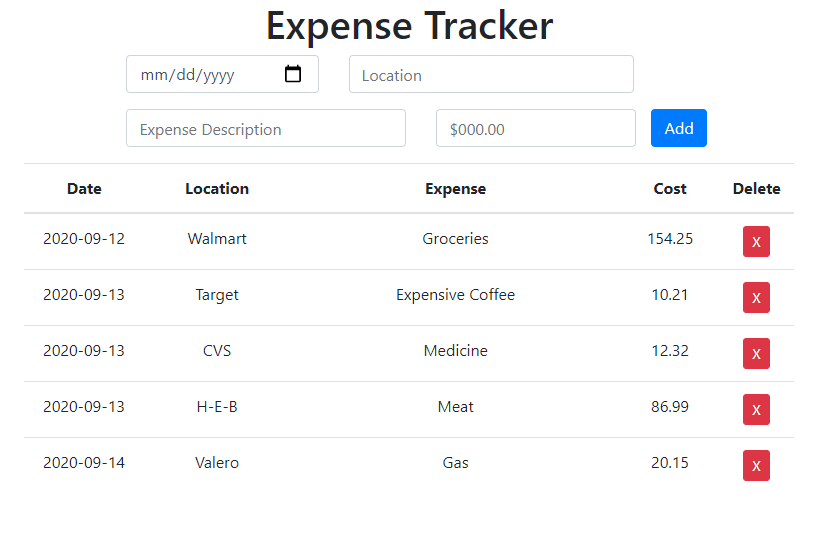

# Expense Tracking App
A clean and simple app for tracking expenses, built using Reactjs and styled with Bootstrap 4

Run Code [Here](https://hc-expense-tracker-react.herokuapp.com/)

## Summary
The Expense Tracking App is a simple and easy way of tracking your expenses. It takes in the date, location, expense description and cost. Displays the data in 
clean table and allows a user to delete the expense if they so choose. It also takes advantage of the local storage to keep your information from clearing.
This is my first app using React-JS, which was very different from using vanilla javascript, but I learned a lot and enjoy making applications that are clean and simple.

## Author
Heriberto Cuellar – Full Stack Software Developer - [LinkedIn](linkedin.com/in/heriberto-c-5aa11952)